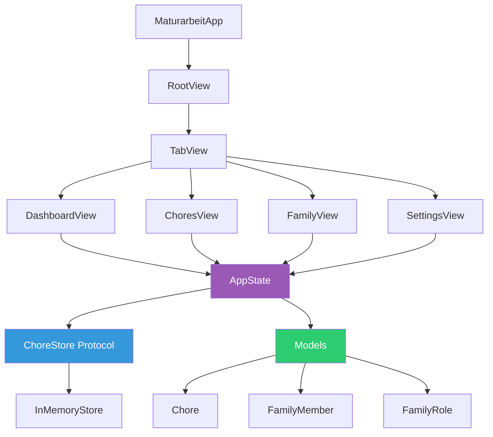

# 🏠 AemtliApp – Familien-Ämtli-Verwaltung

[](https://www.apple.com/ios/)
[](https://swift.org)
[](https://developer.apple.com/xcode/swiftui/)


**AemtliApp** (Schweizerdeutsch für "kleine Aufgabe/Arbeit") ist eine moderne iOS-App, die Familien bei der Verwaltung von Haushaltsaufgaben unterstützt. Eltern können Ämtli mit Punktewerten zuweisen, während Kinder ihre Aufgaben verfolgen und erledigen können.

---

## 📑 Inhaltsverzeichnis

1. [Funktionen](#-funktionen)
2. [Architektur](#-architektur)
3. [Setup & Installation](#-setup--installation)
4. [Projektstruktur](#-projektstruktur)
5. [Dokumentation](#-dokumentation)

---

## ✨ Funktionen

- **📊 Dashboard:** Visuelle Fortschrittsverfolgung mit animiertem Fortschrittsring zur Anzeige des Erledigungsstatus
- **✅ Ämtli-Verwaltung:** Erstellen, Zuweisen und Erledigen von Ämtli mit Punktewerten
- **👨‍👩‍👧‍👦 Familienrollen:** Eltern- und Kinderrollen mit unterschiedlichen Berechtigungen
  - **Eltern:** Können Ämtli hinzufügen, löschen und zuweisen
  - **Kinder:** Können zugewiesene Ämtli ansehen und erledigen
- **☁️ iCloud-Synchronisation:** CloudKit-Integration für geräteübergreifende Datensynchronisation
- **👥 Family-Sharing:** Teilen von Ämtli mit anderen Familienmitgliedern über iCloud
- **🔄 Benutzerwechsel:** Zwischen Familienmitgliedern wechseln, um verschiedene Perspektiven zu sehen
- **⚙️ Einstellungen:** Anzeige grundlegender App-Informationen und Einstellungen

---

## 🏗 Architektur

AemtliApp folgt dem **MVVM (Model-View-ViewModel)** Pattern mit einer protokollbasierten Speicherschicht für Testbarkeit und Erweiterbarkeit.



### Hauptkomponenten

**Models:**
- `Chore` – Repräsentiert eine Haushaltsaufgabe mit Titel, Punkten, Zuweisung, Fälligkeitsdatum und Erledigungsstatus
- `FamilyMember` – Benutzerentität mit Name und Rolle
- `FamilyRole` – Enum zur Definition von Eltern-/Kindberechtigungen

**ViewModels:**
- `AppState` – Haupt-`@MainActor` Observable Object zur Verwaltung von App-Status, Ämtli und Familienmitgliedern

**Store Layer:**
- `ChoreStore` – Protokoll zur Definition von CRUD-Operationen
- `CloudKitStore` – CloudKit-Implementierung mit iCloud-Synchronisation
- `InMemoryStore` – In-Memory-Implementierung mit Beispieldaten

**Views:**
- `RootView` – TabView-Container mit globalem Status
- `DashboardView` – Fortschrittsvisualisierung mit animiertem Ring
- `ChoresView` – Ämtli-Liste mit Hinzufügen-/Löschen-Funktionalität
- `FamilyView` – Familienmitgliederverwaltung und Benutzerwechsel
- `SettingsView` – Einstellungsbildschirm

**CloudKit Layer:**
- `CloudKitManager` – Zentrale CloudKit-Verwaltung und API-Wrapper
- `CloudKitHealthChecker` – Überwachung der iCloud-Verbindung und Berechtigungen
- `CloudKitSubscriptions` – Push-Benachrichtigungen für Datenänderungen
- `RecordMapping` – Mapping zwischen App-Modellen und CloudKit-Records

**Design System:**
- `AppTheme.swift` – Zentralisierte Design-Tokens (Farben, Abstände, Typografie)
- `DesignSystem.swift` – Wiederverwendbare SwiftUI-Komponenten
- `ThemeManager.swift` – Theme-Verwaltung

---

## 🚀 Setup & Installation

### Voraussetzungen

- **Xcode:** 15.0 oder neuer
- **iOS Target:** 17.0+
- **Swift:** 5.10+
- **iCloud Account:** Erforderlich für CloudKit-Synchronisation
- **Abhängigkeiten:** CloudKit, SwiftUI, Foundation

### Installationsschritte

1. **Repository klonen:**
   ```bash
   git clone https://github.com/yourusername/Maturarbeit_2026.git
   cd Maturarbeit_2026
   ```

2. **In Xcode öffnen:**
   ```bash
   open Maturarbeit_2026.xcodeproj
   ```

3. **Zielgerät auswählen:**
   - Einen iOS 17+ Simulator oder ein physisches Gerät auswählen
   - Signatur-Team in **Signing & Capabilities** konfigurieren
   - iCloud-Berechtigung aktivieren (CloudKit-Container wird automatisch konfiguriert)

4. **Build und Run:**
   - `⌘R` drücken oder auf den Run-Button klicken
   - Mit iCloud-Account anmelden für volle Funktionalität
   - Die App startet mit vorgeladenen Beispiel-Ämtli

**Hinweis:** Die App verwendet `CloudKitStore` für persistente Datenspeicherung und Synchronisation über iCloud.

---

## 📁 Projektstruktur

```
Maturarbeit_2026/
├── Maturarbeit.xcodeproj/     # Xcode-Projektdatei
├── Docs/                       # Dokumentation
│   ├── CloudKit-Master-Prompt.md        # CloudKit-Implementierungsdetails
│   ├── Family-Sharing-System.md         # Family-Sharing-Architektur
│   ├── iCloud-Authentication-System.md  # iCloud-Auth-System
│   ├── MASTER-APP-REVIEW-PROMPT.md      # Vollständige App-Übersicht
│   └── UI-Revamp-Notes.md               # UI-Verbesserungsdetails
├── README.md                   # Diese Datei
└── Maturarbeit/               # Quellcode-Ordner
    ├── MaturarbeitApp.swift   # App-Einstiegspunkt
    ├── Models/                # Datenmodelle
    │   ├── Chore.swift        # Ämtli-Entität
    │   ├── ChoreRecurrence.swift # Wiederholungsmuster
    │   ├── FamilyMember.swift # Benutzer-Entität
    │   └── FamilyRole.swift   # Rollen-Enum (Eltern/Kind)
    ├── ViewModels/
    │   └── AppState.swift     # Haupt-App-Status (@MainActor)
    ├── Store/                 # Datenpersistenzschicht
    │   ├── ChoreStore.swift   # Protokoll für CRUD-Operationen
    │   ├── CloudKitStore.swift # CloudKit-Implementierung
    │   └── InMemoryStore.swift # In-Memory-Implementierung
    ├── CloudKit/              # CloudKit-Integration
    │   ├── CloudKitManager.swift      # Zentrale CloudKit-Verwaltung
    │   ├── CloudKitHealthChecker.swift # Verbindungsüberwachung
    │   ├── CloudKitSubscriptions.swift # Push-Benachrichtigungen
    │   └── RecordMapping.swift        # Model-Record-Mapping
    ├── Views/                 # SwiftUI-Views
    │   ├── RootView.swift     # TabView-Container
    │   ├── DashboardView.swift # Fortschrittsvisualisierung
    │   ├── ChoresView.swift   # Ämtli-Liste
    │   ├── FamilyView.swift   # Familienverwaltung
    │   ├── FamilySharingView.swift # Family-Sharing-Einstellungen
    │   └── SettingsView.swift # Einstellungsbildschirm
    ├── DesignSystem/          # UI-Design-System
    │   ├── AppTheme.swift     # Design-Tokens
    │   ├── DesignSystem.swift # Wiederverwendbare Komponenten
    │   └── ThemeManager.swift # Theme-Verwaltung
    ├── Utils/                 # Hilfsprogramme
    │   └── LocalToCloudKitMigration.swift # Datenmigration
    ├── Assets.xcassets/       # App-Assets
    └── Preview Content/       # Preview-Assets
```

---

## 📚 Dokumentation

Zusätzliche Projektdokumentation ist im Ordner `/Docs` verfügbar:

- **[CloudKit-Master-Prompt.md](/Docs/CloudKit-Master-Prompt.md)** – Vollständige CloudKit-Implementierungsdetails und Architektur
- **[Family-Sharing-System.md](/Docs/Family-Sharing-System.md)** – Family-Sharing-System mit iCloud-Integration
- **[iCloud-Authentication-System.md](/Docs/iCloud-Authentication-System.md)** – iCloud-Authentifizierungs- und Berechtigungssystem
- **[MASTER-APP-REVIEW-PROMPT.md](/Docs/MASTER-APP-REVIEW-PROMPT.md)** – Umfassende App-Übersicht und Systemarchitektur
- **[UI-Revamp-Notes.md](/Docs/UI-Revamp-Notes.md)** – Detaillierte UI/UX-Verbesserungen und Design-System

---
