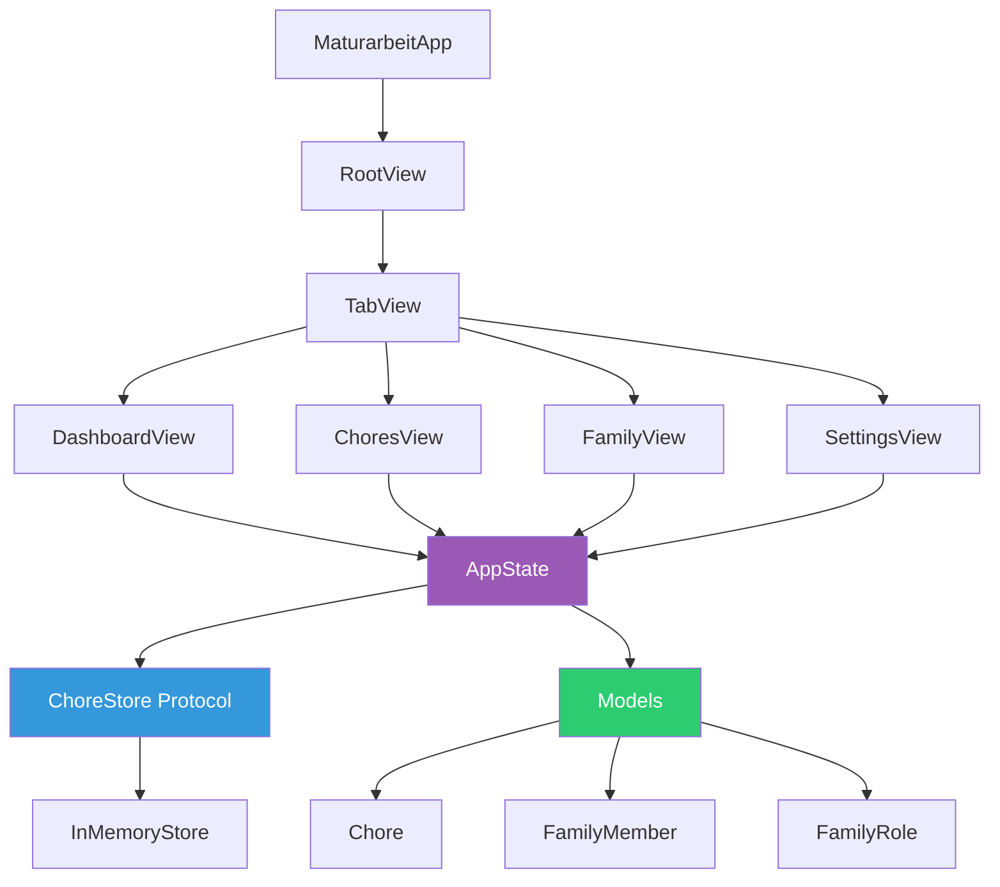

# 🏠 AemtliApp – Family Chore Management

[](https://www.apple.com/ios/)
[](https://swift.org)
[](https://developer.apple.com/xcode/swiftui/)


**AemtliApp** (Swiss German for "small chore/job") is a modern iOS app designed to help families manage household chores and tasks. Parents can assign chores with point values, while children can track and complete their responsibilities.

---

## 📑 Table of Contents

1. [Features](#-features)
2. [Architecture](#-architecture)
3. [Setup & Installation](#-setup--installation)
4. [Project Structure](#-project-structure)
5. [Documentation](#-documentation)

---

## ✨ Features

- **📊 Dashboard:** Visual progress tracking with animated progress ring showing completion percentage
- **✅ Chore Management:** Create, assign, and complete chores with point values
- **👨‍👩‍👧‍👦 Family Roles:** Parent and Child roles with different permissions
  - **Parents:** Can add, delete, and assign chores
  - **Children:** Can view and complete assigned chores
- **🔄 User Switching:** Switch between family members to see different perspectives
- **⚙️ Settings:** Basic app information and settings display

---

## 🏗 Architecture

AemtliApp follows the **MVVM (Model-View-ViewModel)** pattern with a protocol-based storage layer for testability and extensibility.



### Key Components

**Models:**
- `Chore` – Represents a household task with title, points, assignment, due date, and completion status
- `FamilyMember` – User entity with name and role
- `FamilyRole` – Enum defining parent/child permissions

**ViewModels:**
- `AppState` – Main `@MainActor` observable object managing app state, chores, and family members

**Store Layer:**
- `ChoreStore` – Protocol defining CRUD operations
- `InMemoryStore` – Concrete implementation with sample data

**Views:**
- `RootView` – TabView container with global state
- `DashboardView` – Progress visualization with animated ring
- `ChoresView` – Chore list with add/delete functionality
- `FamilyView` – Family member management and user switching
- `SettingsView` – App information display

**Design System:**
- `AppTheme.swift` – Centralized design tokens (colors, spacing, typography)
- `DesignSystem.swift` – Reusable SwiftUI components

---

## 🚀 Setup & Installation

### Requirements

- **Xcode:** 15.0 or later
- **iOS Target:** 17.0+
- **Swift:** 5.10+
- **Dependencies:** None (pure SwiftUI/Foundation)

### Installation Steps

1. **Clone the repository:**
   ```bash
   git clone https://github.com/yourusername/Maturarbeit_2026.git
   cd Maturarbeit_2026
   ```

2. **Open in Xcode:**
   ```bash
   open Maturarbeit_2026.xcodeproj
   ```

3. **Select your target device:**
   - Choose an iOS 17+ simulator or physical device
   - Configure signing team in **Signing & Capabilities**

4. **Build and run:**
   - Press `⌘R` or click the Run button
   - App launches with pre-seeded sample chores

**Note:** The app currently uses `InMemoryStore` for data persistence (data resets on app restart).

---

## 📁 Project Structure

```
Maturarbeit_2026/
├── Models/                    # Data models
│   ├── Chore.swift           # Chore entity
│   ├── FamilyMember.swift    # User entity
│   └── FamilyRole.swift      # Role enum (Parent/Child)
├── ViewModels/
│   └── AppState.swift        # Main app state (@MainActor)
├── Store/                     # Data persistence layer
│   ├── ChoreStore.swift      # Protocol for CRUD operations
│   └── InMemoryStore.swift   # In-memory implementation
├── Views/                     # SwiftUI views
│   ├── RootView.swift        # TabView container
│   ├── DashboardView.swift   # Progress visualization
│   ├── ChoresView.swift      # Chore list
│   ├── FamilyView.swift      # Family management
│   └── SettingsView.swift    # Settings screen
├── DesignSystem/             # UI design system
│   ├── AppTheme.swift        # Design tokens
│   └── DesignSystem.swift    # Reusable components
├── Docs/                      # Documentation
│   └── UI-Revamp-Notes.md    # UI improvement details
├── Assets.xcassets/          # App assets
└── MaturarbeitApp.swift      # App entry point
```

---

## 📚 Documentation

Additional project documentation is available in the `/Docs` folder:

- **[UI-Revamp-Notes.md](/Docs/UI-Revamp-Notes.md)** – Detailed UI/UX improvements, design system implementation, and accessibility enhancements

---
